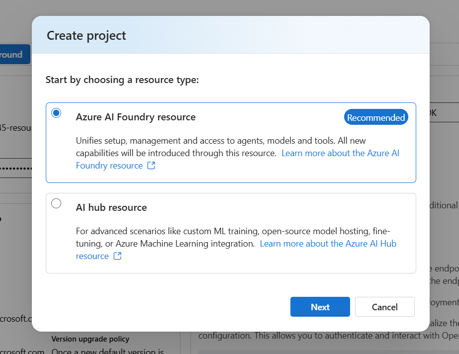
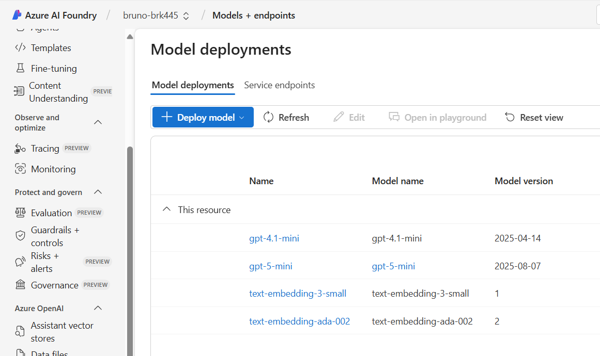
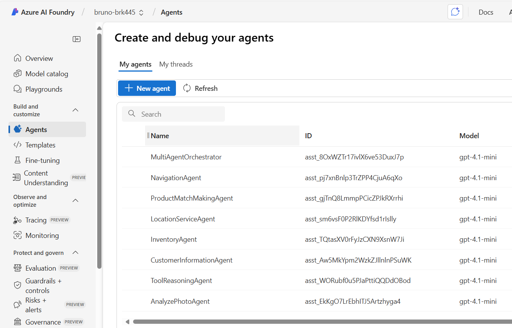
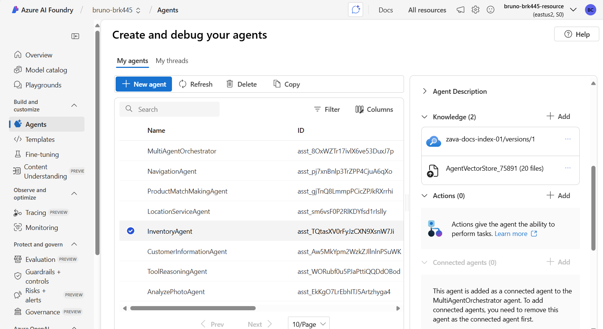
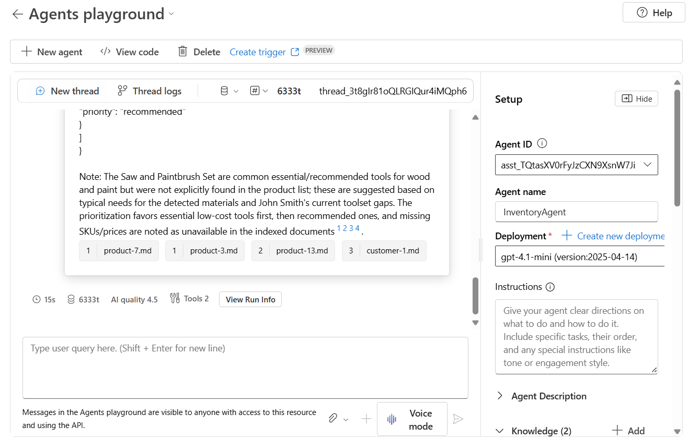
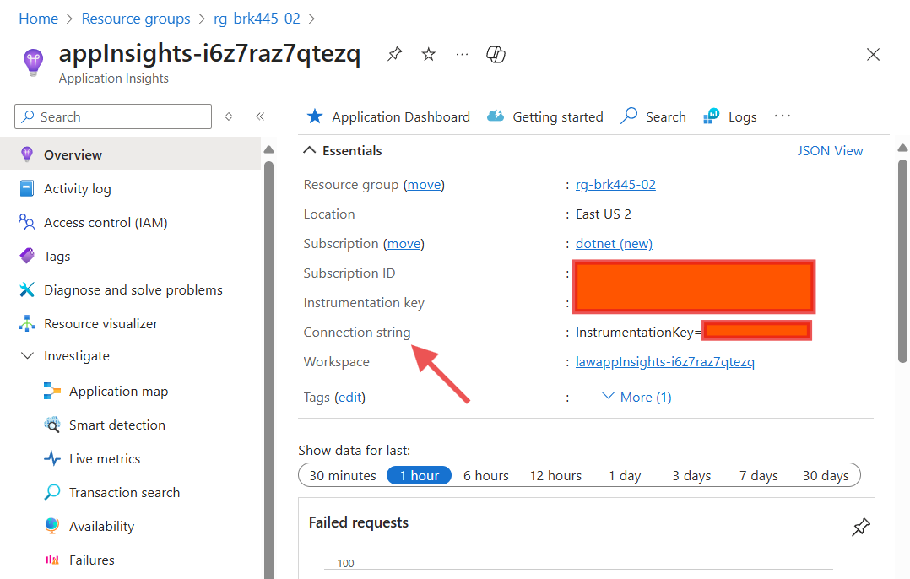

# Create Your Agents in Azure AI Foundry

This tutorial explains how to create and configure the azure resources and agents used by the aspiredemo (Zava‑Aspire) solution. It merges the original step notes with Azure AI Foundry guidance and adds practical tips for connecting agents to the demo solution.

Goals

- Create an AI Foundry project for the demo
- Create the agents required by the demo (Inventory, CustomerInformation, Navigation, LocationService, PhotoAnalyzer, ProductMatchmaking, ToolReasoning)
- Obtain agent IDs and wire them into the aspiredemo configuration

Reference: What is Azure AI Foundry — <https://learn.microsoft.com/azure/ai-foundry/what-is-azure-ai-foundry>

---

## 1) Prerequisites

- Azure subscription with permission to create resources
- Azure AI Foundry access: <https://ai.azure.com>
- Recommended region for this demo: East US 2 (availability may vary by tenant)
- Recommended models: `gpt-4.1-mini` or `gpt-4.1-nano` (choose the best available in your tenant)

---

## 2) Create a Foundry Resource

1. Open <https://ai.azure.com> and sign in with your Azure account.
2. Create a new Project (for example, name it `ZavaDemo`) and choose the region (if available, select East US 2).
3. After the project is created, open it to access Models, Agents, and other resources.

TASK: Copy the project endpoint URL from the Project Settings page. You'll need these to connect the aspiredemo solution to your AI Foundry project.

---

## 3) Prepare model deployments

1. Inside your project, go to the Models area.
1. Create or select model deployments that the solution and agents will use.
1. For the demo we need 2 models
    1. A chat model, recommend `gpt-4.1-mini` or `gpt-4.1-nano` where available.
    1. Optional. For the semantic search demo, need a chat model: `gpt-5-mini` and an embedding model: `text-embedding-ada-002`.

TASK: for the semantic search demo, you need to get the Foundry COnnection string with this format: `Endpoint=https://<your-resource>.cognitiveservices.azure.com/;ApiKey=<your-api-key>`. You can find this in the Settings page of any of the deployed models.

---

## 4) Create agents in the portal

1. In the Project UI, open the **Agents** section and click **Create agent**.
2. Provide these key values:
   - Name: a clear, descriptive agent name (e.g., `PhotoAnalyzerAgent`).
   - Model: select the model deployment you prepared.
   - Instruction / system prompt: the agent’s behavior description. Keep it explicit and testable.
   - Tools and I/O: configure any tool integrations the agent should use.

Create these agents and short descriptions:

- `InventoryAgent` — answer inventory queries and report stock levels.
- `CustomerInformationAgent` — retrieve and validate customer details.
- `NavigationAgent` — calculate navigation routes inside a store.
- `LocationServiceAgent` — perform location lookups and map queries.
- `PhotoAnalyzerAgent` — analyze images and extract product attributes.
- `ProductMatchmakingAgent` — match products given a query and context.
- `ToolReasoningAgent` — orchestrate external tool calls and advanced reasoning.

TASK: After creating each agent, copy the agent’s ID from the agent details page. You'll use these IDs in the aspiredemo configuration.

---

## 5) Add Knowledge to an Agent

A agent retrieves documents from a knowledge store (e.g., Files or Azure AI Search) and generates answers based on retrieved content.

1. Select the InventoryAgent you created.

1. In the agent configuration, select `Add` in the `Knowledge` section.

1. Upload the documents from the `session-delivery-resources/data/` folder.

1. If you also have an Azure AI Search index with Zava information, you can connect the index to the agent.

1. Test the agent with a sample prompt, from the [prompts\Inventory Agent Sample Prompts.txt]  to ensure it retrieves and uses the knowledge correctly.

1. The results should include references to the knowledge source.

---

## 6) Create an Application Insights resource in Azure

1. In the Azure portal, create a new Application Insights resource in the same region as your Foundry project.

TASK: Copy the Connection String from the Application Insights resource overview page.

