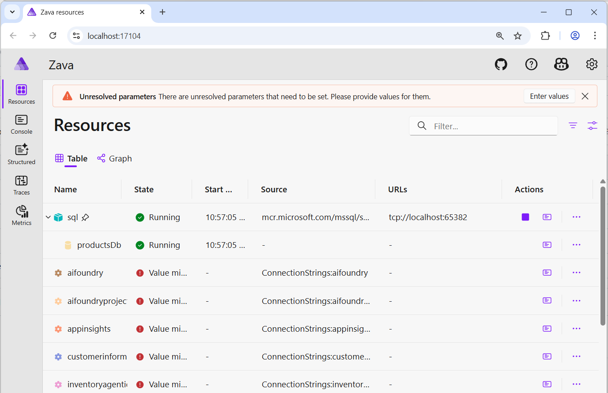
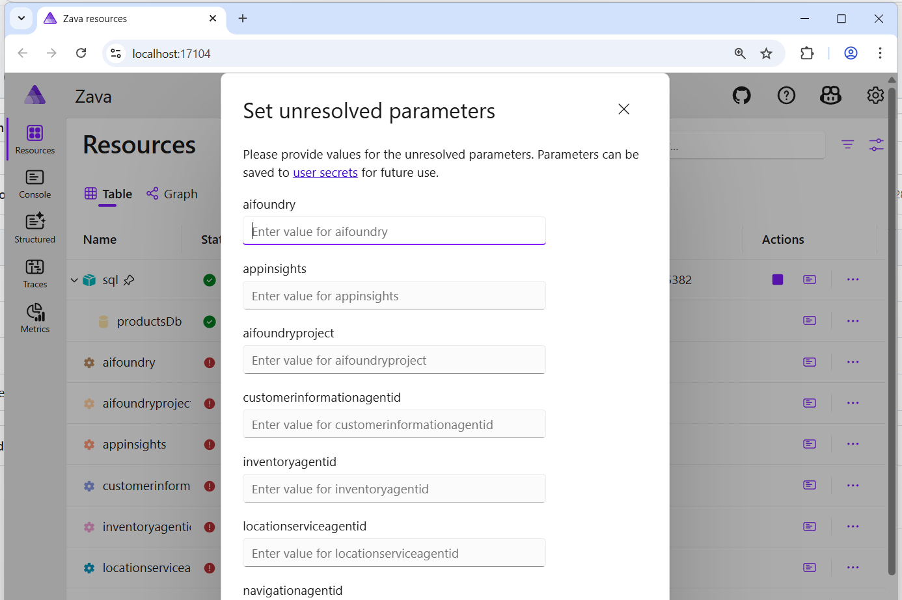

# How to run the demo locally

This file provides step-by-step instructions to build and run the `aspiredemo` (Zava-Aspire) solution locally. It is a split-off from the original `01.Installation.md` to make the run instructions easier to follow.

## Agent Framework Selection

This solution supports two agent frameworks that you can switch between using the **Settings page** in the Store frontend:

1. **Semantic Kernel (SK)** - Default framework using Microsoft.SemanticKernel
2. **Microsoft Agent Framework (AgentFx)** - Uses Microsoft.Agents.AI

### Selecting the Agent Framework

After running the demo:

1. Open the **Store** application in your browser
2. Navigate to **Settings** from the navigation menu (left sidebar)
3. Use the toggle switch to select your preferred framework:
   - **Toggle OFF** = Semantic Kernel (SK) - Default
   - **Toggle ON** = Microsoft Agent Framework (AgentFx)
4. Your selection is automatically saved in your browser's localStorage
5. All agent demos will immediately use the selected framework (no restart needed)

**Note:** Both frameworks connect to the same Azure AI Foundry agents. The selection only affects which orchestration framework is used.

## Quick start (terminal)

Open PowerShell / Bash in the solution folder and run:

```powershell
# Restore dependencies
dotnet restore Zava-Aspire.slnx

# Build the solution
dotnet build Zava-Aspire.slnx

# Trust local dev certs for HTTPS
dotnet dev-certs https --trust

# Run the app host
dotnet run --project ./ZavaAppHost/ZavaAppHost.csproj
```

## Running in Visual Studio

1. Open `aspiredemo\Zava-Aspire.slnx` in Visual Studio.
2. In Solution Explorer, right-click the project '1 Aspire/ZavaAppHost' to run and select `Set as Startup Project`.
3. Press F5 to run (or Ctrl+F5 to run without debugging).

## Running in Visual Studio Code / Visual Studio Code Insiders

1. Open `aspiredemo` folder in Visual Studio Code / Visual Studio Code Insiders.
2. In Solution Explorer, right-click the project '1 Aspire/ZavaAppHost' to run and select `Set as Startup Project`.
3. Right-Click '1 Aspire/ZavaAppHost', Select 'Debug' -> 'Start New Instance'

The console will display the listening URL(s) (for example `https://localhost:17104/login?t=7040c2fb1bad0ebe1a467bd1ad076f5e`). Open the indicated URL in your browser to access the demo UI.

## 1st run: set secrets

The first time running the solution, the .NET Aspire dashboard will require you to set up the necessary secrets for accessing Azure resources. Complete the values in the form:

- `aifoundry` is the connection string: `Endpoint=https://<your-resource>.cognitiveservices.azure.com/;ApiKey=<your-api-key>`
- `applicationinsights` is the Application Insights connection string from your Application Insights resource
- `aifoundruyproject` is the Project endpoint URL from your AI Foundry project settings page
- `customerinformationagentid`, `inventoryagentid` and all the other agent ids are the agent IDs you created in the previous step; see `02.NeededCloudResources.md` for details.

Check the `Save to user secrets` box to save them in your user secrets project for future runs.




